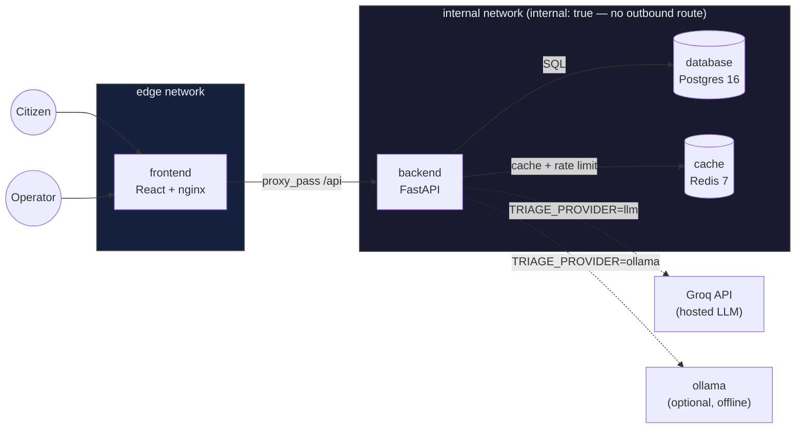
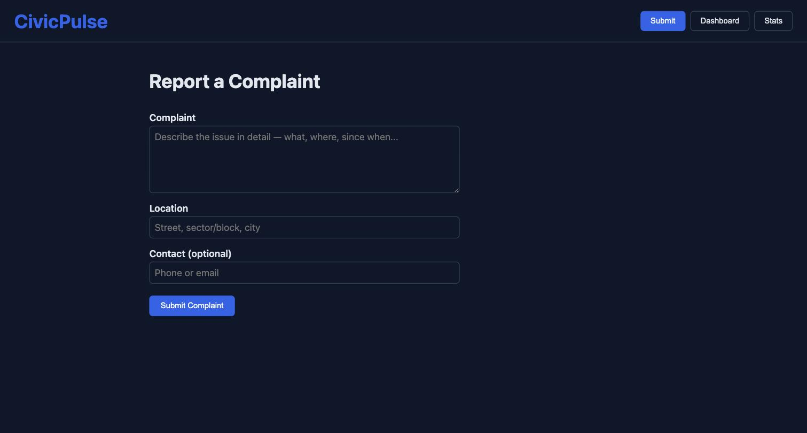
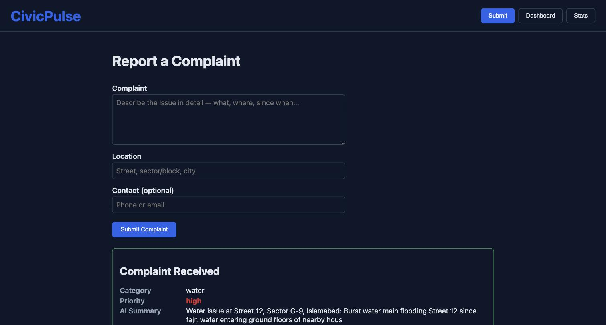
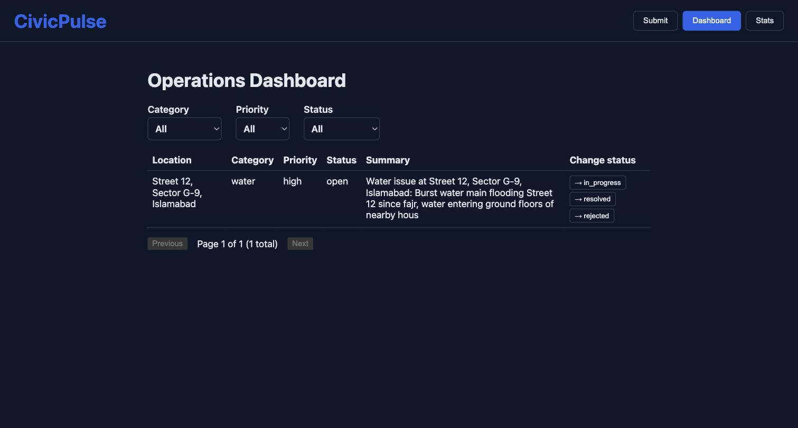
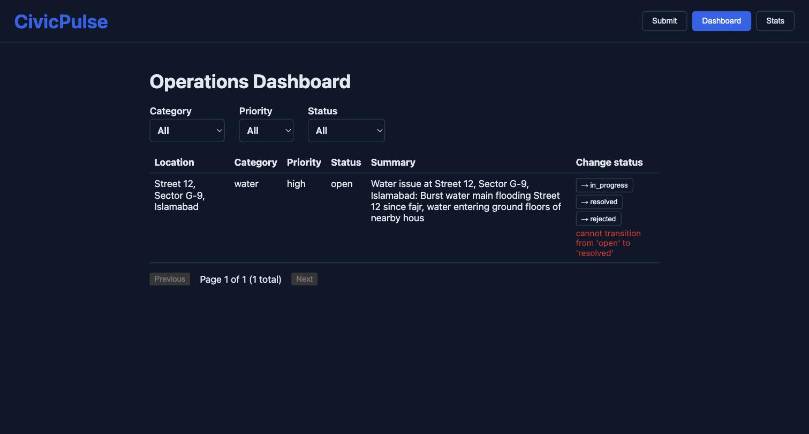
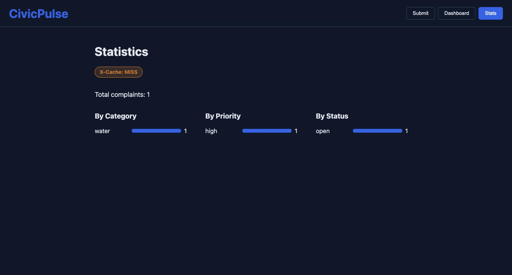

# CivicPulse

[](https://github.com/Schwifty101/civicpulse/actions/workflows/ci.yml)
[](https://github.com/Schwifty101/civicpulse/actions/workflows/cd.yml)
[](LICENSE)

> A burst water main gets reported by nine neighbours in a queue four hundred items long,
> sitting behind three streetlight complaints, because nothing sorted them. CivicPulse reads
> the free text with an AI triage step, sorts it in seconds, and makes sure the system never
> falls over when the AI is slow, wrong, or rate-limited.

## The problem

Municipal complaint intake is one undifferentiated queue. A dropdown category picker fails
in practice — citizens pick "Other" to get through the form faster, or pick wrong, or can't
judge urgency. The information citizens actually give you is in the text. Something has to
read it, and whatever reads it has to be replaceable: a keyword rule today, a hosted LLM
tomorrow, a fine-tuned classifier next year — without the rest of the system caring which.

## What this is

An end-to-end complaint intake, AI triage, and operations platform: a citizen submits a
complaint, the backend validates → triages (category, priority, one-line summary, via a
pluggable `TriageProvider`) → persists it, and an operations dashboard surfaces it live with
aggregate stats. Five cooperating containers on a laptop with one command; a scaled, probed,
autoscaling workload on Kubernetes in CI.

## Architecture



`backend` is the only service that bridges `edge` and `internal` — `frontend` physically
cannot reach `database`/`cache` (`docker compose exec frontend ping database` fails by
network design, not application logic). See `docs/adr/` for the reasoning behind each
non-obvious choice.

## Quickstart

```bash
git clone https://github.com/Schwifty101/civicpulse.git
cd civicpulse
cp .env.example .env
docker compose up -d --build
curl http://localhost:8000/ready
docker compose exec backend python -m scripts.seed    # ≥30 seeded complaints, idempotent
```

Frontend: **http://localhost:8080** · Backend OpenAPI docs: **http://localhost:8000/docs**

Ships with `TRIAGE_PROVIDER=rules` by default — zero API keys required to see the whole
system working. Set `GROQ_API_KEY` in `.env` and `TRIAGE_PROVIDER=llm` for the hosted-LLM
path, or see `docs/RUNBOOK.md` for the fully offline Ollama path.

## Screenshots

| Submit — form | Submit → triaged result |
|---|---|
|  |  |

| Dashboard — list view | Dashboard — server's 409 surfaced verbatim |
|---|---|
|  |  |

| Stats — X-Cache badge |
|---|
|  |

Kubernetes: `kubectl apply -k k8s/overlays/dev` — full steps in `docs/RUNBOOK.md`.

### Further evidence

All of the following live in `docs/evidence/`:

| Evidence | What it shows |
|---|---|
| `branch-protection-rules-list.jpg`, `-required-checks.jpg`, `-detail-1.jpg` | `main` protected: PR required, ≥1 approval, required status checks |
| `merge-conflict.md` + `merge-conflict-markers.txt` | The deliberate merge conflict (§A), real conflicting branches kept on the remote, resolution reasoning |
| `network-segmentation.txt` | `frontend` provably cannot reach `database` — DNS resolution itself fails, not just a blocked connection |
| `hpa-watch.log` + `hpa-scaling-chart.png` | `kubectl get hpa -w` under `k6` load, 2→10 replicas, referenced in `docs/ENGINEERING-NOTES.md` Q5 |

## API

| Method | Path | Behaviour |
|---|---|---|
| `POST` | `/api/complaints` | Validate → triage → persist. `201`, `400` field errors, `429` + `Retry-After` |
| `GET` | `/api/complaints/{id}` | `200` / `404` |
| `GET` | `/api/complaints` | Filter by category/priority/status, paginated (`page`, `page_size≤100`), returns `total` |
| `PATCH` | `/api/complaints/{id}/status` | Explicit state machine; invalid transition → `409` naming it |
| `GET` | `/api/stats` | Aggregates, Redis-cached 30s, `X-Cache: HIT\|MISS` |
| `GET` | `/api/meta/providers` | Active provider + last 20 triage outcomes + cache hit rate |
| `GET` | `/health` | Liveness — never touches the database |
| `GET` | `/ready` | Readiness — `503` naming the failed dependency |
| `GET` | `/metrics` | Prometheus text format |

## Repository layout

```
backend/    FastAPI app: routes → services → repositories → providers, Alembic, tests
frontend/   React + Vite + TS, nginx-served, reverse-proxies /api same-origin
k8s/        Kustomize base + dev/prod overlays
load/       k6 load script for the HPA scale-out demo
docs/       ADRs, runbook, engineering notes, AI usage, evidence screenshots
.github/    ci.yml, cd.yml, release.yml
```

## Engineering documentation

- `docs/adr/0001-provider-interface.md` — the `TriageProvider` contract
- `docs/adr/0002-frontend-runtime-config.md` — why the frontend never bakes in an API URL
- `docs/adr/0003-deploy-by-sha.md` — why `:latest` is pushed but never deployed
- `docs/adr/0004-pii-and-data-governance.md` — what leaves the machine, and to whom
- `docs/TRIAGE.md` — how a complaint actually gets classified, cached, and falls back
- `docs/RUNBOOK.md` — deploy, roll back, read logs, what to do when triage fails
- `docs/ENGINEERING-NOTES.md` — the eight required reflection questions, with file/line refs
- `docs/AI-USAGE.md` — honest AI-assistance disclosure

## Status of this build

Solo, AI-assisted session (see `docs/AI-USAGE.md`). The parts of §A that genuinely require
a second person — a partner's substantive PR review, a two-person commit split, an
individual viva — are structurally out of scope for a single contributor and aren't
claimed here. A deliberate merge conflict (§A) doesn't require a second person, so it's
real: see `docs/evidence/merge-conflict.md`. Everything else in the spec — the running
system, the four-layer backend, the AI triage layer, the Docker/Compose network
segmentation, the Kubernetes manifests, and the CI/CD pipeline — is implemented and
verified in this repository.

## License

[MIT](LICENSE)
